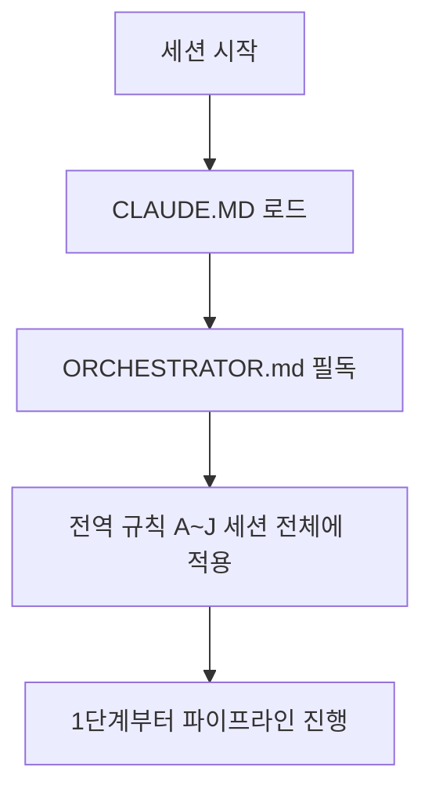

# HANESS_AUTO — 13단계 개발 하네스 시스템

이 저장소는 범용 재사용 가능한 13단계 개발 파이프라인 하네스다. 이 프로젝트에서 작업을 시작하기 전에 **[ORCHESTRATOR.md](ORCHESTRATOR.md)를 반드시 먼저 읽는다** — 전체 페르소나(20년차 개발/기획/설계/보안/디자인 기준), 전역 규칙(A~J: 모르면 질문, 최소 2회 내부 검증, 완전한 테스트 결과서, 단계 게이트, 배포 승인, 실패 피드백 루프, 의사결정 로그, 요구사항 추적성, 규제 민감 도메인 대응, AI/LLM 기능 내장 대응), 13단계 파이프라인 정의(11단계 문서화/인수인계 포함), 자동화 트리거 설계가 모두 여기에 있다.

- 각 단계 서브에이전트 정의: `.claude/agents/01-trend-analyst.md` ~ `13-post-deploy-verifier.md`
- 공통 양식: `templates/verification-log-template.md`, `templates/test-report-template.md`, `templates/decision-log-template.md`, `templates/traceability-matrix-template.md`
- 자동화(CI/git hook) 예시: `automation/`

ORCHESTRATOR.md의 규칙은 이 저장소 안에서는 예외 없이 적용된다. 특히 규칙 A(모르면 반드시 질문, 임의 진행 금지)와 규칙 E(배포는 사용자 승인 없이 절대 실행 금지)는 어떤 상황에서도 우회하지 않는다.

