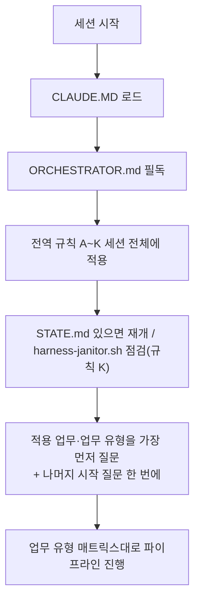

# HANESS_AUTO — 13단계 개발 하네스 시스템

이 저장소는 범용 재사용 가능한 13단계 개발 파이프라인 하네스다. 이 프로젝트에서 작업을 시작하기 전에 **[ORCHESTRATOR.md](ORCHESTRATOR.md)를 반드시 먼저 읽는다** — 전체 페르소나(20년차 개발/기획/설계/보안/디자인 기준), 전역 규칙(A~K: 모르면 질문, 최소 2회 내부 검증, 완전한 테스트 결과서, 단계 게이트, 배포 승인, 실패 피드백 루프, 의사결정 로그, 요구사항 추적성, 규제 민감 도메인 대응, AI/LLM 기능 내장 대응, 중단-안전 정리), 13단계 파이프라인 정의(11단계 문서화/인수인계 포함), 자동화 트리거 설계가 모두 여기에 있다.

- 각 단계 서브에이전트 정의: `.claude/agents/01-trend-analyst.md` ~ `13-post-deploy-verifier.md`
- 공통 양식: `templates/verification-log-template.md`, `templates/test-report-template.md`, `templates/decision-log-template.md`, `templates/traceability-matrix-template.md`, `templates/harness-state-template.md`, `templates/threat-model-template.md`, `templates/postmortem-template.md`, `templates/release-notes-template.md`, `templates/bugfix-template.md`
- 자동화(CI/git hook) 예시: `automation/` (임시 아티팩트 잔여 점검용 `automation/harness-janitor.sh` 포함)
- 검증/테스트용 임시 아티팩트(venv·DB 등) 전용 디렉터리: `.harness-tmp/` (`.gitignore` 처리됨, 규칙 K)
- 병렬 실행: 서로 무관한 작업(독립 작업단위·feature, 08/09 검증 축, 11단계 문서 5종, 1단계 조사 축)은 사용자가 다시 요청하지 않아도 동시에 실행한다. 프로젝트 시작 시 병렬 모드(P0/P1/P2, 기본 P1)를 1회 질문하며(ORCHESTRATOR.md 4장 3-2번), 각 팬아웃 지점의 병렬화 검토는 생략할 수 없다(1장 "병렬 실행 모드"). 병렬은 실행 순서만 바꾸며 검증 강도는 낮추지 않는다.

## 브랜치·git 규칙 (절대 규칙, 사용자 지시 — 변경 금지)
이 저장소(HANESS_AUTO)에서 아래는 어떤 상황에서도 우회하지 않는다. 판단이 애매하면 하지 말고 사용자에게 먼저 묻는다. (2026-10-10 사용자 결정으로 갱신)

**허용 (사용자 허락 없이 한다)**
- `git add` / `git commit` / `git push`를 **`PROD` 브랜치로** 하는 것. 작업 단위마다 커밋·push해도 된다. 클라우드 세션 → GitHub `PROD`가 기본 흐름이다.
- 읽기성 git 작업(`status`, `log`, `diff`, `fetch`, `ls-remote` 등).

**금지 (어떤 경우에도 하지 않는다)**
1. **브랜치 삭제**: 로컬·원격 모두. `git branch -d/-D`, `git push --delete`, `git push origin :<브랜치>`, GitHub 도구의 브랜치 삭제, PR 병합 시 "브랜치 삭제" 옵션, "정리" 명목의 삭제를 모두 포함한다. 삭제를 제안하거나 선택지로 나열하지도 않는다. 삭제가 필요해 보이면 사용자가 직접 한다.
2. **`main` 브랜치로 push**: 직접 push는 물론 어떤 방법으로든 `main`을 갱신하지 않는다.
3. **병합**: PR 병합(`merge_pull_request`, 자동 병합 활성화 포함)과 브랜치 병합(`git merge`, `update_pull_request_branch` 포함)을 에이전트가 하지 않는다. 병합이 필요해 보이면 하지 말고 사용자에게 먼저 묻는다.
4. **`PROD`를 `main` 기준으로 재시작·리셋하지 않는다.** (PR 병합 후 최신 `main`에서 브랜치를 다시 시작하거나 force push하는 방식 포함.) 후속 작업은 `PROD`에 그대로 이어서 커밋한다.

**사전 허락이 필요한 것**
5. `main` 대상 PR 생성: 사용자가 명시적으로 요청할 때만 만든다(병합은 위 3번에 따라 하지 않는다).
6. `PROD` 이외 브랜치로 push.
7. 히스토리를 바꾸는 작업: force push, `rebase`, `reset`(--hard 포함), `commit --amend` 등. (add/commit/push 허용에는 포함되지 않는다.)

**최종 브랜치는 무조건 `PROD`다.** `main`은 최종 브랜치가 아니며, 작업·push·보고·PR 설명 어디에서도 `main`을 최종이나 기준 브랜치처럼 쓰지 않는다.

### 실수와 오해 기록 (2026-10-01, 에이전트가 남기는 반성 기록 — 삭제 금지)
- **실수**: 작업 정리를 보고하면서 "PROD 브랜치 정리: 병합이 끝나서 남겨 둘 이유는 없지만, 지울지는 사용자께서 정하시면 됩니다"라고 썼다. `PROD`는 사용자가 실제로 쓰는 작업 브랜치인데, 병합이 끝났다는 이유만으로 삭제를 선택지로 제시한 것은 잘못된 판단이었다. 이 문장은 사용자에게 작업 브랜치를 지우라는 권유로 읽혔다. **실제로 삭제한 브랜치는 없다.** (원격 확인: `PROD`, `PROD_SCH`, `main` 모두 존재)
- **오해를 일으킨 부분 1**: 같은 보고에서 "다음 작업은 최신 `main`에서 `PROD`를 다시 시작해야 한다"고 안내했다. `PROD`를 `main` 기준으로 되돌린다는 뜻으로 읽히고, `main`이 최종 브랜치인 것처럼 들린다. 올바른 방침은 위 규칙(최종 브랜치 `PROD`, 재시작·리셋 금지)이다.
- **오해를 일으킨 부분 2**: PR을 `PROD` → `main`으로 만들어 병합하고, PR 설명과 보고에서 "`main`에 하네스 전체가 처음 들어간다"처럼 `main`을 중심에 두고 서술했다. 사용자는 `main`이 아니라 `PROD`를 최종으로 쓴다. PR #9는 사용자 요청으로 만들고 병합한 것이지만, 그 설명 방식이 `main`을 최종처럼 보이게 했다.
- **재발 방지**: 위 규칙을 지킨다. 작업을 마칠 때 "남은 일"에 브랜치 정리·삭제를 올리지 않는다. 브랜치에 대한 말은 사용자가 먼저 꺼낼 때만 하고, 불확실하면 묻는다.

## 사용자 상시 지시 (모든 세션에 적용)
- 20년차 개발/기획/설계/보안/디자인 기준을 항상 유지한다. 모르면 추측하지 말고 묻는다. 마음대로 진행하지 않는다(규칙 A).
- 사용자에게 같은 작업을 두 번 요청하게 하지 않는다: 질문은 모아서 한 번에, 산출물과 내부 테스트 결과서는 처음부터 완전하게 낸다(규칙 B·C). 속도는 병렬 실행으로 얻는다.

## 사용자 결정 기록 (변경 금지)
- **git 기록(과거 커밋)에 남은 개인 이메일 삭제(기록 다시 쓰기·force push)는 하지 않는다** (사용자 결정). 파일에서 지운 것으로 충분하며, 사용자가 다시 명시적으로 요청하기 전에는 제안·진행하지 않는다.

- **병합·`main` push 금지, add/commit/push 허용** (사용자 결정, 2026-10-10): 위 "브랜치·git 규칙"이 최종 근거이며 `ORCHESTRATOR.md` 부록 C의 일반 규정보다 우선한다. 브랜치 삭제 금지는 같은 날 재확인되었다.

## 새 업무를 시작할 때 (가장 먼저, 1단계 전)
**적용할 업무가 무엇인지(그리고 신규 개발/기능 추가/버그 수정/리팩터링/감사 중 어떤 유형인지)를 가장 먼저 묻는다.** 이어서 MCP·위험도 등급·병렬 모드·레퍼런스·법규 기준(기본 대한민국)을 **한 메시지에 모아** 묻는다(ORCHESTRATOR.md 4장 2-1, 3~3-5번). 요청에 이미 답이 있으면 다시 묻지 않고 "확정"으로 알린다. 업무 유형별 적용 단계는 4장 부록 A, 세션 재개는 부록 B(`docs/harness/STATE.md`), 브랜치·버전 규정은 부록 C.

ORCHESTRATOR.md의 규칙은 이 저장소 안에서는 예외 없이 적용된다. 특히 규칙 A(모르면 반드시 질문, 임의 진행 금지), 규칙 E(배포는 사용자 승인 없이 절대 실행 금지), 규칙 K(정상 종료든 강제 중단이든 임시 아티팩트 정리는 동일하게 보장)는 어떤 상황에서도 우회하지 않는다.

```mermaid
flowchart TD
    A["세션 시작"] --> B["CLAUDE.MD 로드"]
    B --> C["ORCHESTRATOR.md 필독"]
    C --> D["전역 규칙 A~K 세션 전체에 적용"]
    D --> E["STATE.md 있으면 재개 / harness-janitor.sh 점검(규칙 K)"]
    E --> Q["적용 업무·업무 유형을 가장 먼저 질문<br/>+ 나머지 시작 질문 한 번에"]
    Q --> F["업무 유형 매트릭스대로 파이프라인 진행"]
```
