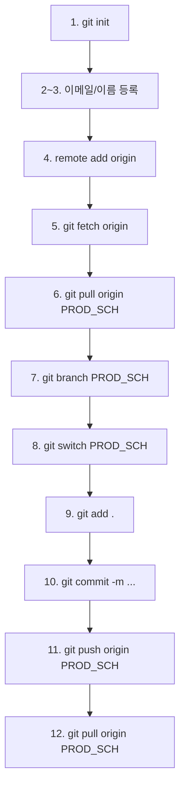

# 1. git 초기화
git init

# 2. 내 이메일 등록 (따옴표 안에 본인 이메일을 적으세요)
git config --global user.email "jcs197530@gmail.com"

# 3. 내 이름 등록 (따옴표 안에 본인 영문 이름을 적으세요)
git config --global user.name "정찬성"

# 4. 내 컴퓨터와 인터넷 창고 주소를 연결합니다.
git remote add origin https://github.com/jcs19752510-ui/HANESS_AUTO.git

# 5. 깃허브에 있는 main이나 PROD_SCH 같은 브랜치 정보들을 내 컴퓨터가 인식하게 됩니다.
git fetch origin

# 6. PROD_SCH 모두 데이터 로컬로 내리기
git pull origin PROD_SCH

# 7. 현재 브랜치명을 'PROD_SCH'으로 브랜치 생성
git branch PROD_SCH

# 8. PROD_SCH 브랜치로 작업 공간을 이동 (Switch)
git switch PROD_SCH

# 9. 로컬 소스 추가할 목록 add
git add .

# 10. 로컬 add한 소스 commit 항목에 추가(코멘트 추가)
git commit -m "하네스 전체 자동화 프로그램"

# 11. 로컬 commit한 항목 리모트 브랜치에 push
git push origin PROD_SCH

# 12. 원격소스 로컬 브랜치에 내리기
git pull origin PROD_SCH

<!--
참고용 다이어그램(최종 근거는 위 명령어 자체):
-->
