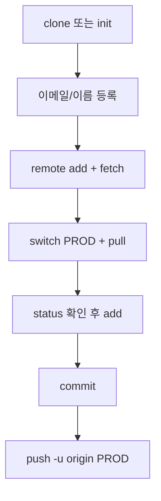

# git 연동 절차 (HANESS_AUTO 템플릿 저장소)

> 이 템플릿 저장소의 **최종 브랜치는 `PROD`**다. `PROD`로의 add/commit/push는 허용되고, 브랜치 삭제·`main` push·병합은 하지 않는다(CLAUDE.MD "브랜치·git 규칙" 참고). 아래 `<...>` 부분은 본인 값으로 바꿔 입력한다. 이메일·이름 같은 개인정보는 이 문서에 적지 않는다.

```bash
# 1. git 초기화 (이미 clone 했다면 생략)
git init

# 2~3. 본인 이메일·이름 등록 (이 저장소에만 적용하려면 --global 을 빼고 실행)
git config --global user.email "<본인 이메일>"
git config --global user.name "<본인 이름>"

# 4. 원격 저장소 연결
git remote add origin https://github.com/<소유자>/HANESS_AUTO.git

# 5. 원격 브랜치 정보 가져오기
git fetch origin

# 6. PROD 브랜치로 이동 (로컬에 없으면 원격 PROD를 추적하며 생성)
git switch PROD || git switch -c PROD --track origin/PROD

# 7. 최신 내용 받기
git pull origin PROD

# 8. 변경 확인 후 필요한 파일만 추가 (git add . 는 임시 파일이 섞일 수 있어 git status로 확인 후 사용)
git status
git add <파일 또는 폴더>

# 9. 커밋
git commit -m "<변경 내용 요약>"

# 10. 원격에 올리기
git push -u origin PROD
```

## 참고
- 프로그램(프로젝트)을 새로 만들 때는 이 템플릿을 복사한 별도 저장소에서 작업한다(USAGE-GUIDE.md 참고). 그 저장소의 브랜치·PR·버전 규정은 ORCHESTRATOR.md 4장 부록 C를 따른다.
- 과거에 쓰던 `PROD_SCH` 브랜치도 삭제하지 않고 그대로 둔다. 새 작업은 `PROD`에서 한다.


```mermaid
flowchart TD
    A["clone 또는 init"] --> B["이메일/이름 등록"]
    B --> C["remote add + fetch"]
    C --> D["switch PROD + pull"]
    D --> E["status 확인 후 add"]
    E --> F["commit"]
    F --> G["push -u origin PROD"]
```
