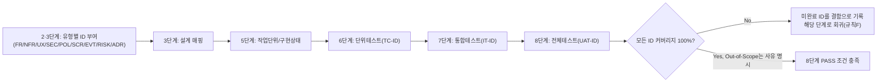

# 요구사항 추적 매트릭스 (Requirements Traceability Matrix)

> 2단계(기획서=PRD)·3단계(설계서=TRD)에서 유형별 ID를 생성하고, 이후 모든 단계가 갱신한다. 8단계(전체 풀테스트) 완료 조건은 이 매트릭스의 모든 행이 "구현"과 "테스트" 컬럼까지 채워져 있는 것이다 (제외 항목은 사유 명시).

## ID 유형 범례 (ORCHESTRATOR.md 규칙 H가 최종 근거)
| 접두사 | 의미 | 1차 부여 단계 |
|---|---|---|
| `FR-` | 기능 요구사항 | 2(PRD) |
| `NFR-` | 비기능 요구사항 | 2(PRD) / 3(TRD) |
| `UX-` | UX/사용성 요구사항 | 4(디자인서) |
| `SEC-` | 보안 요구사항 | 3(TRD) |
| `POL-` | 서비스 정책 | 2(PRD) |
| `SCR-` | 화면 정의 | 4(디자인서) |
| `EVT-` | 이벤트/API 명세 | 3(TRD) |
| `RISK-` | 리스크 항목 | 2(PRD) |
| `ADR-` | 아키텍처 결정 기록 | 3(TRD), `decisions.md`의 DEC-ID와 상호참조 |
| `TC-` | 테스트 케이스 | 6·7·8 |
| `IT-` | 통합 테스트 시나리오 | 7 |
| `UAT-` | 사용자 인수 테스트 항목 | 8 |

| ID | 유형 | 요구사항/기능 (출처 문서 §) | 설계 매핑 (TRD §) | 작업 단위 (unit-n) | 구현 상태 | 단위테스트 (TC-ID) | 통합테스트 (IT-ID) | 전체테스트 (UAT-ID) | 비고 |
|----|------|------------------------------|---------------------|----------------------|------------|----------------------|------------------------|---------------------------|------|
| FR-001 | FR |  |  |  | Not Started / In Progress / Done |  |  |  |  |

## 작성 규칙
- ID는 2단계(PRD)·3단계(TRD)에서 위 범례의 유형에 맞는 접두사로 하나씩 부여한다. 이후 단계에서 새 ID를 임의로 추가하지 않고, 새 요구사항이 필요하면 규칙 A에 따라 질문하거나 규칙 F(피드백 루프)로 상위 단계를 수정한다.
- Out-of-Scope로 명시된 항목은 매트릭스에 포함하되 상태를 "Out-of-Scope(사유)"로 표기해, 나중에 "빠뜨린 것"과 "의도적으로 뺀 것"을 구분할 수 있게 한다.
- 8단계에서 이 매트릭스를 검토해 커버리지 100%를 확인하지 못하면 PASS 판정할 수 없다.
- 기존에 무타입 "REQ-001" 식으로 이미 만들어진 프로젝트의 매트릭스는, 다음 규칙 F 재작업이나 신규 ID 추가 시점부터 점진적으로 위 유형별 접두사로 전환한다 — 진행 중인 매트릭스 전체를 소급해서 일괄 변경하지 않는다.

## ID 생애주기 (참고용 다이어그램)
> 아래 다이어그램은 하나의 ID가 단계를 거치며 채워지는 흐름을 시각적으로 요약한 참고 자료다. 최종 근거는 항상 위 표와 작성 규칙이다.

